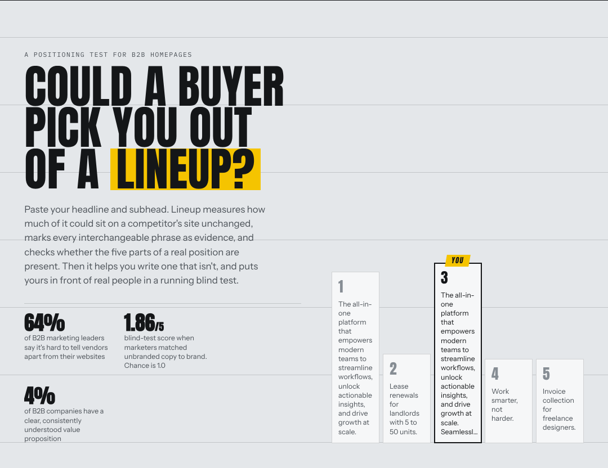
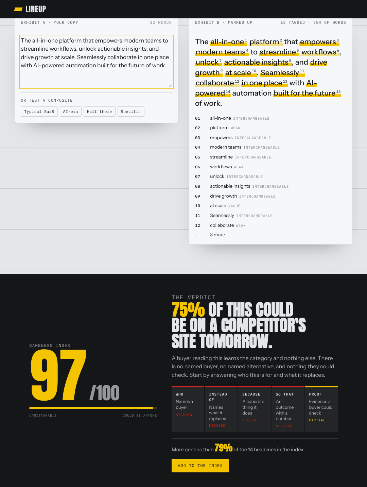
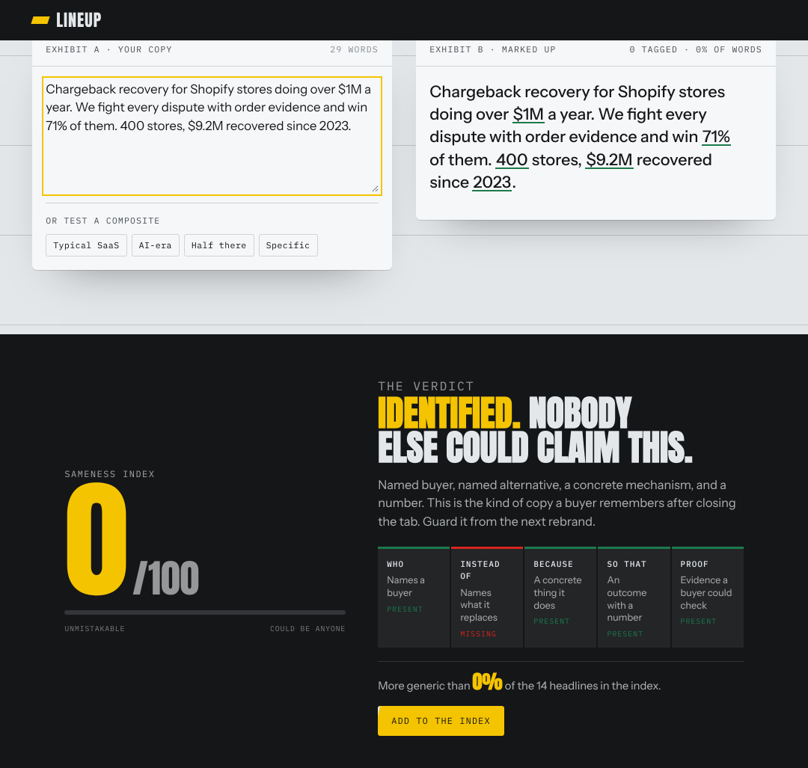
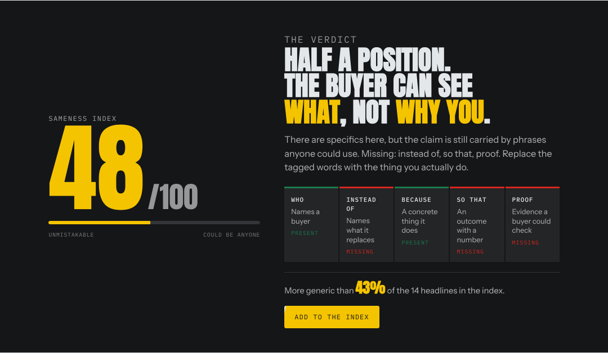
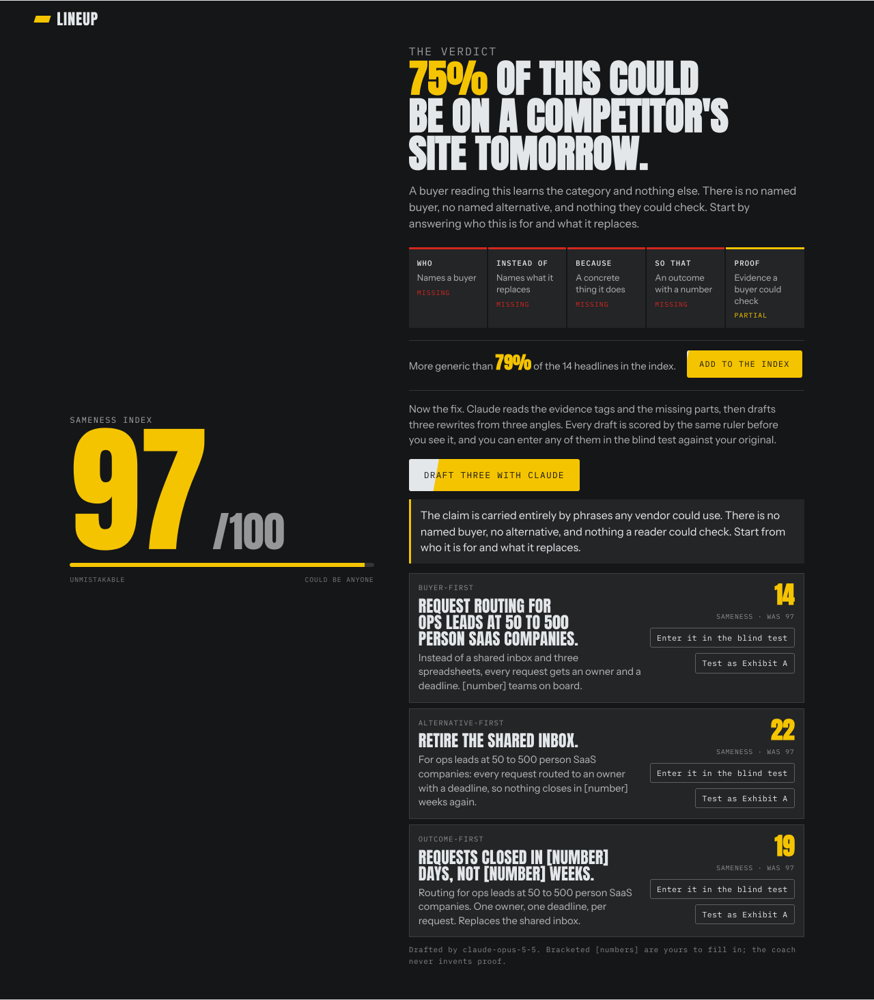
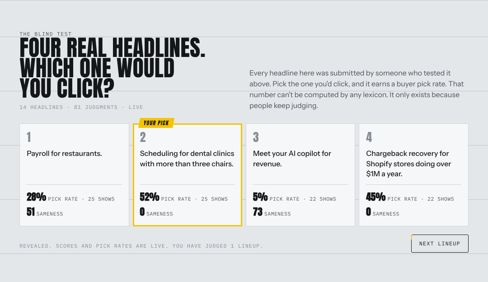
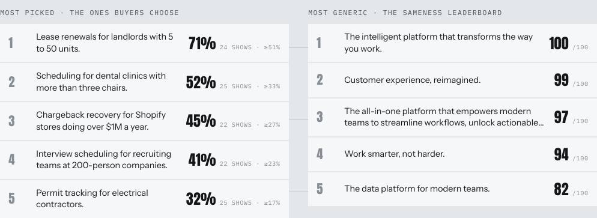

<p align="center">
  
</p>

<h1 align="center">Lineup</h1>

<p align="center"><strong>Could a buyer pick you out of a lineup?</strong><br>
A sameness test for B2B homepage copy. A ruler, and a crowd. No AI required.</p>

<p align="center">
  <a href="https://project-rip1l.vercel.app">Try it</a> ·
  <a href="#run-it">Run it</a> ·
  <a href="#how-the-score-works">How the score works</a> ·
  <a href="#api">API</a> ·
  <a href="CONTRIBUTING.md">Contribute</a>
</p>

<p align="center">
  <a href="https://github.com/neelbarm/GTMTool/actions/workflows/test.yml"></a>
  
  
  <a href="LICENSE"></a>
</p>

---

Paste a headline and subhead. Lineup tells you how much of it could sit on a competitor's site unchanged, tags every interchangeable phrase as evidence, checks whether the five parts of a real position are present, and helps you rewrite it. Then it puts your headline in front of real people in a running blind test and tells you how often they would click it.

## Why

- Wynter's June 2026 differentiation study showed 100 B2B SaaS marketing leaders five real value props with the names removed. They matched copy to brand at **1.86 out of 5**. Chance is 1.0. **64%** said it is outright difficult to tell vendors apart from their websites.
- Bain surveyed more than 1,000 B2B leaders for its 2026 B2B Growth Agenda. Only **4%** had a value proposition that was both clear and consistently understood. Those companies grew 19% in 2025. The rest grew 12%.

Everyone complains about pipeline. Sameness is the thing upstream of it that nobody measures. Lineup measures it.

## What it does

### The ruler

Every tagged phrase is evidence, numbered, with a reason. The score is deterministic: same input, same number, every time.

<p align="center"></p>

The same ruler on copy that only one company could have written:

<p align="center"></p>

### The five parts

Who it's for. What it replaces. Why you. The outcome. The proof. Each one present, partial, or missing.

<p align="center"></p>

### The fix

With a key set, the verdict ends with the coach. Claude reads the tagged phrases and the missing parts, drafts three rewrites from three angles, and every draft goes back through the ruler before it is shown. Any draft can enter the blind test as a variant of the original, so the crowd decides which one wins.

<p align="center"></p>

### The crowd

Four headlines from the index, no logos. Visitors pick the one they would click. Every headline earns a pick rate, ranked by the lower bound of a Wilson interval so one lucky showing never tops the board.

<p align="center"></p>

<p align="center"></p>

### Everything else

| Part | What you get |
|---|---|
| **Sameness index** | 0 to 100. The share of your words carried by interchangeable B2B phrases, weighted by how empty each is, plus a penalty per missing part, minus credit for checkable specifics. |
| **The index** | Add your headline to a shared corpus. Your score comes back as a percentile against everyone before you. |
| **Variants** | Submit a second version of your headline. Both compete against the field, never against each other in the same lineup, and the page calls a winner once each has ten showings. |
| **Badges** | `/badge/:id.svg` shows a headline's sameness score and pick rate. Put it in a README or on a site. |
| **Share pages** | `/e/:id` carries Open Graph tags with the score and pick rate in the title. Paste it on LinkedIn. |
| **Open data** | `/api/export.csv` downloads the whole index with scores, parts and pick rates. |
| **The workbench** | Five plain-English slots assemble a specific headline and rescore it live. |
| **The coach** | With a Claude API key, the verdict ends with three rewrites from three angles. Each is scored by the ruler before you see it, and each is one click from entering the blind test against your original. |
| **The batch** | `npm run batch` scores 100 real homepages and prints the phrases that appear on the most sites. |
| **The eval** | `npm run eval` measures the ruler against the crowd: how often the picked headline had the lowest score, and where the two disagree. |

## Run it

Needs Node 22.13 or newer. It uses the SQLite built into Node, so there is nothing to install for the core.

```sh
git clone https://github.com/neelbarm/GTMTool lineup
cd lineup
npm run seed     # 14 fictional composites so the blind test works on day one
npm start        # http://localhost:3000
npm test         # model, calibration set, batch, eval and API tests
npm run batch    # score 100 real homepages (scripts/sites.txt) and print the most common phrases
npm run eval     # measure the ruler against the crowd's votes
```

Data lives in `./data/lineup.sqlite`. Set `DATA_DIR` to put it elsewhere.

### Deploy

Anything that runs Node and keeps a disk works. The Dockerfile seeds and starts the server; mount a volume at `/data`.

```sh
docker build -t lineup .
docker run -p 3000:3000 -v lineup_data:/data -e ADMIN_TOKEN=change-me lineup
```

- **Render:** New → Blueprint → point it at this repo. `render.yaml` sets up the service and a 1 GB disk.
- **Fly.io:** `fly launch --copy-config`, `fly volumes create lineup_data --size 1`, `fly deploy`.
- **Vercel:** `vercel.json` and `api/index.js` are included for test deployments. The index is stored in `/tmp`, so it resets when the function goes cold. Fine for a demo, not for the real instance.

| Variable | Default | What it does |
|---|---|---|
| `PORT` | `3000` | Listen port |
| `DATA_DIR` | `./data` | Where the SQLite file lives |
| `SITE_URL` | request host | Absolute URL used in share pages and badges |
| `ADMIN_TOKEN` | unset | Enables `DELETE /api/entries/:id` with `Authorization: Bearer <token>` to hide spam |
| `TRUST_PROXY` | `0` | Set to `1` behind a reverse proxy so rate limits key on `X-Forwarded-For` |
| `LINEUP_SECRET` | generated | Signs lineup tokens. Generated once and stored in the database if unset. |

### The coach

The ruler, the index and the blind test run without any AI. The coach needs a key. Ship with it on: install the SDK, set the key, and the verdict ends with a "Draft three with Claude" button.

```sh
npm install                       # pulls @anthropic-ai/sdk, the only optional dependency
ANTHROPIC_API_KEY=sk-ant-... npm start
```

The coach reads the ruler's findings, writes a three-sentence critique, fills the five slots as far as the copy allows, and drafts three rewrites: buyer-first, alternative-first, outcome-first. Every draft is scored by the same deterministic model before it is shown, so the ruler stays the judge. It never invents numbers or customers; where the copy has no proof it leaves a bracketed placeholder for you to fill.

| Variable | Default | What it does |
|---|---|---|
| `ANTHROPIC_API_KEY` | unset | Enables the coach |
| `COACH_MODEL` | `claude-opus-5-5` | Which Claude model drafts |
| `COACH_DAILY_CAP` | `200` | Rounds per day on this instance, so a public deploy has a known ceiling. Ten per hour per IP on top. |

## Score a batch of real homepages

```sh
npm run batch                       # reads scripts/sites.txt, writes data/batch.csv
node scripts/batch.js mine.txt --out out.csv --concurrency 4
```

Each site is fetched once. The first `<h1>` and the paragraph after it are scored; if there is no usable `<h1>`, the Open Graph description, the meta description or the title stands in. The CSV has one row per site with the score, the five parts and the headline. The summary prints the median, the share that could be anyone, the share of sites missing each part, and the phrases found on the most sites. Edit `scripts/sites.txt` to score your own category.

## Measure the ruler against the crowd

```sh
npm run eval                        # reads the live database
node scripts/eval.js --min-shows 20 --json
```

Every vote is a human judgment: four headlines shown, one picked. If the sameness score means anything, the picked headline should tend to have the lowest score in its set. The eval reports how often that holds against the 25% you would get by chance, the rank correlation between score and pick rate, and two lists of disagreements: headlines the ruler called generic that the crowd keeps picking, and headlines it called specific that the crowd ignores. Each one is a lexicon gap, a detector gap, or a reason the crowd is not the buyer. Fix the model, rerun `npm test`, and the golden set tells you what moved.

## How the score works

The model is one file, [`lib/model.js`](lib/model.js), used by both the page and the server, so the number you see in the browser is the number that goes in the index.

1. **Lexicon match.** About 240 phrases that could sit on any B2B site, each weighted 0.3 to 1.0 by how empty it is. Longest match first, no overlaps.
2. **Emptiness.** Weighted matched words over total words, raised to 0.6 and scaled to 60 points, so the first few empty phrases cost more than the last few.
3. **Missing parts.** Ten points for each of the five parts that is missing, four if partial. A buyer counts as named when "for", "built for" or "helps" is followed by a phrase that could not describe every company: a proper noun, a number, an industry, a role, a trade, or a plural noun that is not on the generic list. "Modern teams" and "businesses of all sizes" are not buyers. The other parts are detected by pattern: a named alternative, a concrete noun, an outcome with a number, proof with a number.
4. **Specifics credit.** Up to 15 points back for numbers, concrete nouns and proper nouns. Without a single number the credit is capped at 4 and 6 points are added, because a claim with no number is one a buyer cannot check.
5. Clamped to 0 to 100.

It cannot tell whether a claim is true. It rewards a specific lie. Treat it as a linter, not a judge.

[`test/golden.json`](test/golden.json) is a labelled set of forty fictional headlines. The model must keep every generic one above every specific one and each band inside its range. Change the model and the golden tests tell you what moved.

## API

| Method | Path | Notes |
|---|---|---|
| `GET` | `/api/entries?limit=1000` | The index without full text. Each entry: `id, head, score, covered, parts, shows, picks, rate`. |
| `POST` | `/api/entries` | `{text, variantOf?}`. 12 to 400 characters. `variantOf` is an indexed entry id; the new entry joins its group. Returns `201` with the entry, or `200` with `duplicate: true`. 20 per hour per IP. |
| `GET` | `/api/entries/:id` | One entry with full text, stats, and its `variants`. |
| `DELETE` | `/api/entries/:id` | Admin only. Hides the entry. |
| `GET` | `/api/lineup?exclude=id&seen=id,id` | Four random entries from four different groups, preferring ones the caller hasn't seen, plus a signed single-use `token` good for an hour. |
| `POST` | `/api/votes` | `{token, pick, voter}`. The token must come from `/api/lineup`, so a vote can only be cast on a lineup the server served, once. One vote per voter per set of four. 300 per hour per IP. |
| `GET` | `/badge/:id.svg` | Badge. Green under 45, yellow to 69, red from 70. |
| `GET` | `/e/:id` | Share page with Open Graph tags, redirects to the app. |
| `GET` | `/api/export.csv` | Everything, for analysis. |
| `POST` | `/api/coach` | `{text}`. A critique, the five slots, and three scored rewrites. `503` when no key is configured. |
| `GET` | `/api/health` | `{ok, coach, entries, votes}` |

## Project layout

```
server.js          HTTP server, SQLite store, routes, rate limits, signed lineup tokens
lib/model.js       the scoring model (shared by browser and server)
lib/coach.js       the optional Claude coach
public/index.html  the page
scripts/seed.js    seeds 14 fictional composites
scripts/batch.js   scores a list of real homepages (scripts/sites.txt)
scripts/eval.js    measures the ruler against the crowd's votes
test/              model tests, golden calibration set, API tests, coach tests
```

## Contributing

The most valuable contributions are to the lexicon and the part detectors in `lib/model.js`. If you've seen a phrase on four different homepages, it belongs in the lexicon. If a real, specific headline scores badly, open an issue with the text and the score. See [CONTRIBUTING.md](CONTRIBUTING.md).

## License

MIT. The index data on the public instance is published under the same terms: download it, analyze it, cite it, link back.
